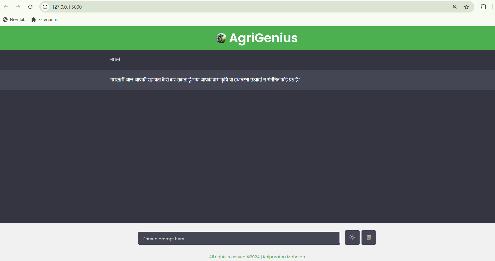
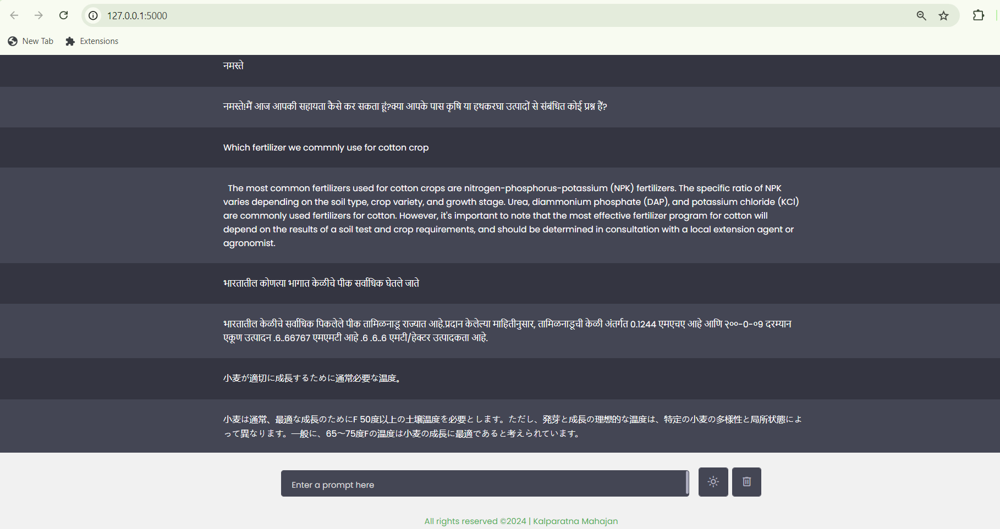

# AgriGenius Chatbot

AgriGenius is an intelligent chatbot designed to answer agriculture-related questions by fetching content from websites and PDFs, translating text using Google Translate, and leveraging a robust language model. This project uses Python, Flask, RAG, LLM, GENAI, API, LangChain, NLP for the backend, and HTML, CSS, and JavaScript for the frontend.

## Features

- Fetches content from websites and PDFs
- Multi-Language Support
- Answers agriculture-related questions
- Beautiful and user-friendly interface
- Stores conversation history

## Tech Stack

- **Backend**: Python, Flask, RAG, LLM, GENAI, API, LangChain, NLP
- **Frontend**: HTML, CSS, JavaScript
- **Language Model**: Meta LLaMA
- **Vector Store**: Chroma
- **Embeddings**: SentenceTransformer
- **Translation**: Google Translate

## Prerequisites

- Python 3.8 or higher
- Flask

## Installation

1. **Clone the repository**

   ```bash
   git clone https://github.com/yourusername/agrigenius-chatbot.git
   cd agrigenius-chatbot
   ```

2. **Create a virtual environment and activate it**

   ```bash
   python -m venv venv
   source venv/bin/activate  # On Windows use `venv\Scripts\activate`
   ```

3. **Install the required packages**

   ```bash
   pip install -r requirements.txt
   ```

4. **Create a `.env` file**

   Create a `.env` file in the root directory of the project and add your Together API key and Google Translate API key:

   ```
   API_KEY=your__api_key
   GOOGLE_TRANSLATE_API_KEY=your_google_translate_api_key
   ```

## Usage

1. **Run the Flask application**

   ```bash
   flask run
   ```

2. **Access the chatbot**

   Open your browser and go to `http://127.0.0.1:5000` to use the AgriGenius chatbot.

## Project Structure

```
agrigenius-chatbot/
├── app/
│   ├── __init__.py
│   ├── routes.py
│   ├── static/
│   │   ├── css/
│   │   └── js/
│   ├── templates/
│   │   └── index.html
│   └── utils.py
├── .env
├── requirements.txt
├── run.py
└── README.md
```

## Key Files

- **`app/routes.py`**: Contains the Flask routes and view functions.
- **`app/utils.py`**: Contains utility functions for fetching content, translation, and query handling.
- **`app/templates/index.html`**: The main HTML file for the chatbot interface.
- **`.env`**: Environment variables file for API keys.
- **`run.py`**: The entry point to run the Flask application.

## Initial Setup

1. **Load environment variables**

   ```python
   from dotenv import load_dotenv
   import os

   load_dotenv()

   together_api_key = os.getenv('TOGETHER_API_KEY')
   google_translate_api_key = os.getenv('GOOGLE_TRANSLATE_API_KEY')
   ```

2. **Initialize the language model**

   ```python
   from some_module import Together  # Replace with the actual import for Together

   llm = Together(
       model="meta-llama/Llama-2-70b-chat-hf",
       max_tokens=256,
       temperature=0.1,
       top_k=1,
       together_api_key=api_key
   )
   ```

## Project Demo

For a detailed demonstration of the AgriGenius chatbot, you can watch the project video [here](https://drive.google.com/file/d/1S6G1OXv2e6Wbw6-UmE9NuHpT5MAvsPlR/view?usp=sharing).

## Project Images





## License

This project is licensed under the MIT License - see the [LICENSE](LICENSE) file for details.

## Contact

If you have any questions or feedback, please contact us at [kalparatna223@gmail.com].
